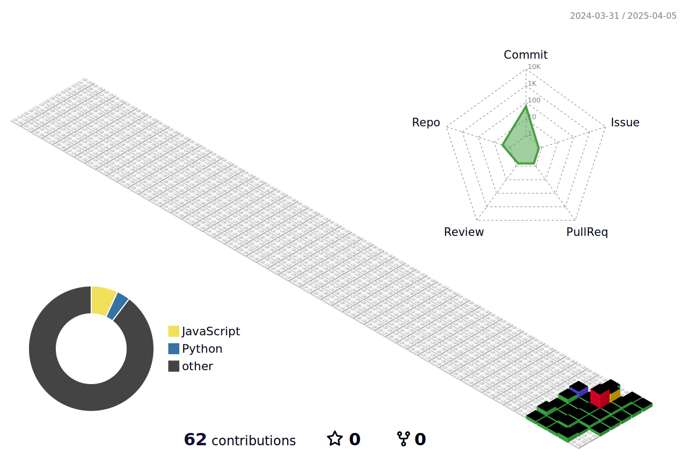
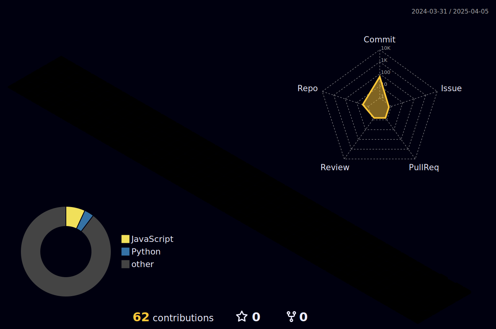

<!-- Header -->

## 🧱 Tech Stack
<!-- Baekjoon Online Judge -->
<!--  -->

### Mainly Used
<!-- Tech List -->
     

### I've used it before
    

### I'm going to try it

 

## 🏆 Details

Project

<!-- 예시 -->
<!-- |2025.01 | **📷 Instoolgram** | Instagram Reels Downloader | [🐈](https://github.com/seondal/Instoolgram) &nbsp; [🔗](https://instoolgram.seondal.kr) | -->
|개발기간|프로젝트|소개|바로가기|
|:-:|:-|:-|:-:|
|2025.03 | **📸 DB_Transfer** | DB 데이터 이전 프로그램 |  |

Career

<!-- 예시 -->
<!-- |2022.09 ~ 23.02| 신촌연합 IT 창업동아리 [**CEOS**](https://github.com/seondal/CEOS-FE-Study) | 16기 프론트 | -->
|기간|근무처|담당업무|
|:-:|-:|:-|
|2023.04 ~ 24.04| 클립데이터 | SI 개발 |

 

## 🤔 Github Stats
<!-- 3D Profile -->

<!--  -->

<!-- Status01_languages 

-->
<!-- Status02_status

-->
<!-- Status03_graph

-->

<!-- Snake

-->
